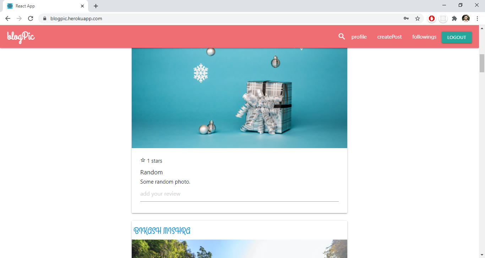
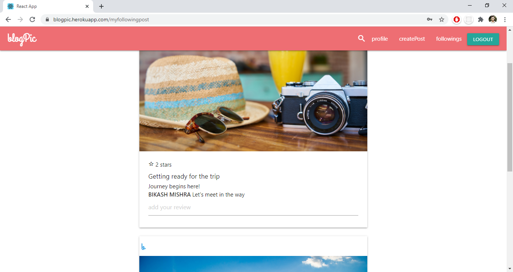
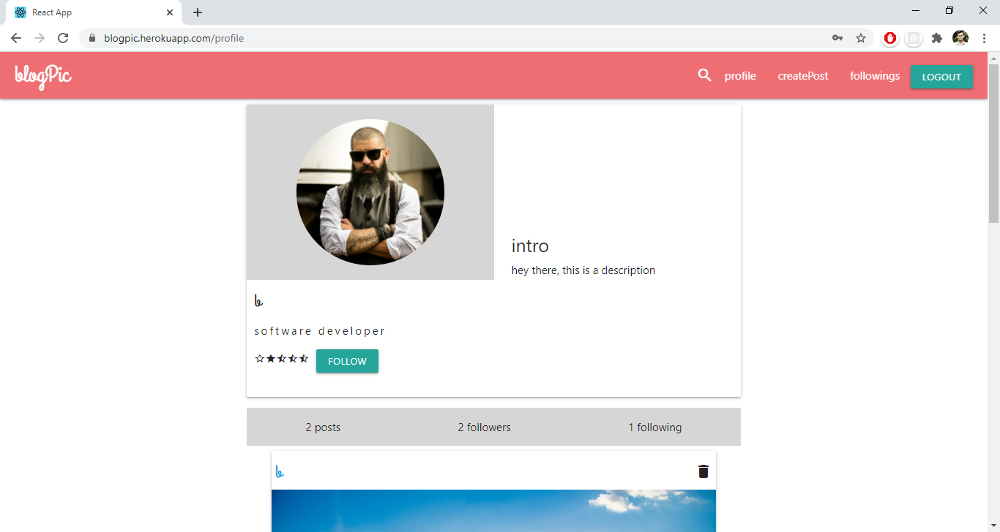
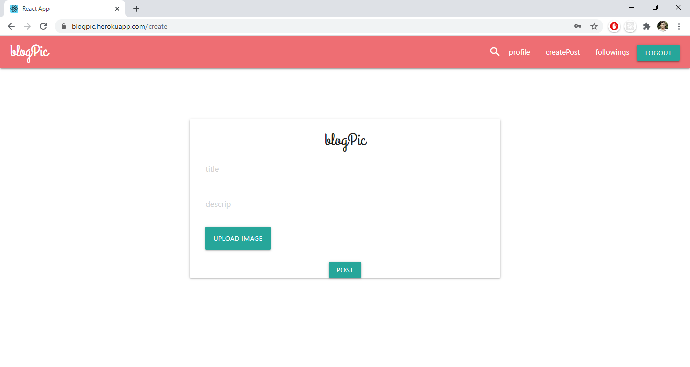
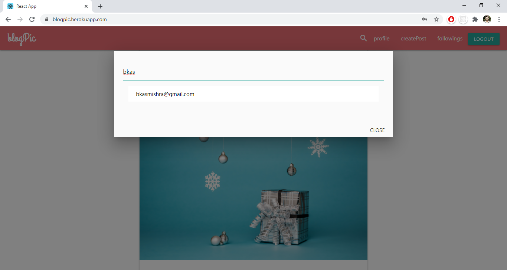
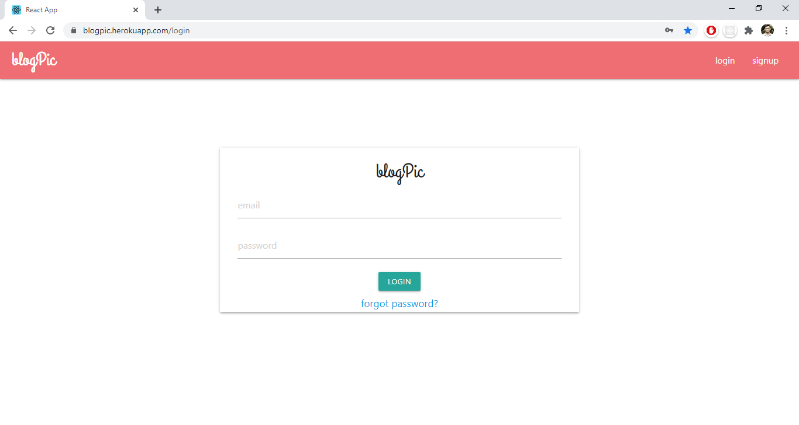
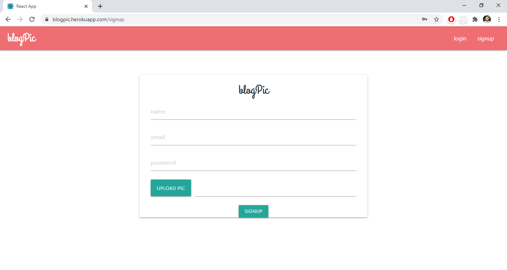
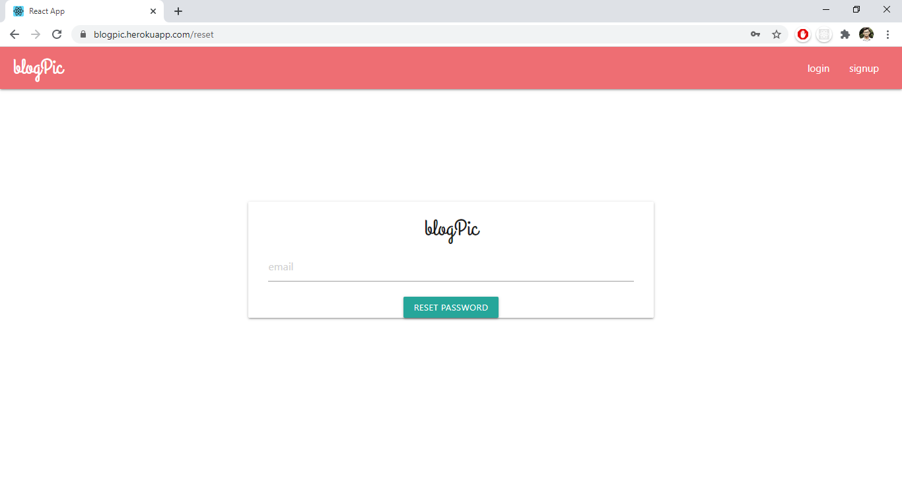

# blogPic 

> A social network web app to share and connect with people around the world.

- Live App: [blogpic.herokuapp.com](https://blogpic.herokuapp.com)

I always used to think how a huge social network works. So I built this social network out of curiosity to know how things work.

blogPic is a full stack social network having almost all significant features which are listed below in Features section.

# Quick links
1. [Features](#features)
2. [Built With](#built-with)
3. [Preview](#preview)
4. [Screens](#screens)
5. [Deployment](#deployment)
6. [License](#license)

## Features

 * Login, Signup, Logout, Forgot password (with email verification)
 * Custom photo feed based on who you follow
 * All photos feed
 * Post Image (with caption and description)
   * Like posts
   * Comment on posts
   * Delete posts
 * Search for users
    * Search based on email id
 * Profile Screen
   * Follow / Unfollow Users
   * Default profile avatar
   * Upload profile picture
   * Post/Follower/Following count
   * Personal feed

## Built With

* [mongoDB](https://www.mongodb.com/) - The Database used
* [Express](https://expressjs.com/) - Web framework for Node.js used
* [React](https://reactjs.org/) - JavaScript library for user interface used
* [nodeJS](https://nodejs.org/) - JavaScript runtime used
* [REST API](https://en.wikipedia.org/wiki/Representational_state_transfer) - Architectural style used
* [JWT Authentication](https://jwt.io/) - Authentication used
* [Redux](https://redux.js.org/) -  State Container used for state management
* [bcrypt](https://www.npmjs.com/package/bcrypt) - Library used for hashing passwords
* [Mongoose](https://mongoosejs.com/) - Used for mongodb object modeling
* [Postman](https://www.postman.com/) - Used to develop and test API
* [HTML/CSS/Materialize CSS](https://materializecss.com/) - Used for basic markup and styling
* [SendGrid API](https://sendgrid.com/) - Used for sending Password Reset emails

##  Preview

##  Screens

###  Screen (Home)

###  Screen (Followings)

###  Screen (Profile)

###  Screen (Create post)

###  Screen (Search users)

###  Screen (Login)

###  Screen (Signup)

###  Screen (Reset Password)

## Deployment

Deployed to Heroku
- Live App
     - [blogpic.herokuapp.com](https://blogpic.herokuapp.com)

## License
[MIT](https://choosealicense.com/licenses/mit/)

**Thanks for reading**
